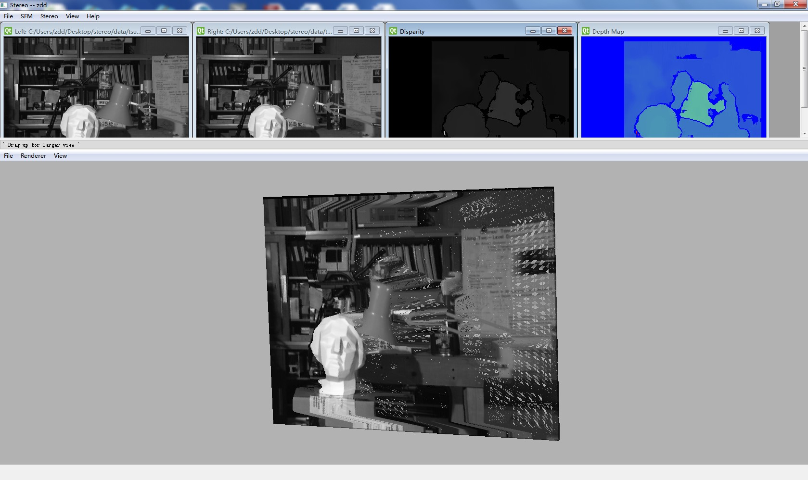

struct_from_motion
==================

Struct from motion simple sulotion
It can reconstruct 3D model through two images using disparity method.

Overview:
---------

Build environment
-----------------

Qt5.1(win32-msvc2010)
OpenCV2.4.6(x86)

It can be easily ported to other platforms

How to use
----------

1.Open left and right image.  (File->Open Left Image¡¢File->Open Right Image)
2.Get Depth Map (Stereo->Depth Map)
3.Create 3D. (Stereo->Create 3D, make sure click Stereo->Depth Map first.)
4.View->3D view : open/close 3Dview, Drag up for larger view.

Contact me
----------

*<zddhub@gmail.com>
